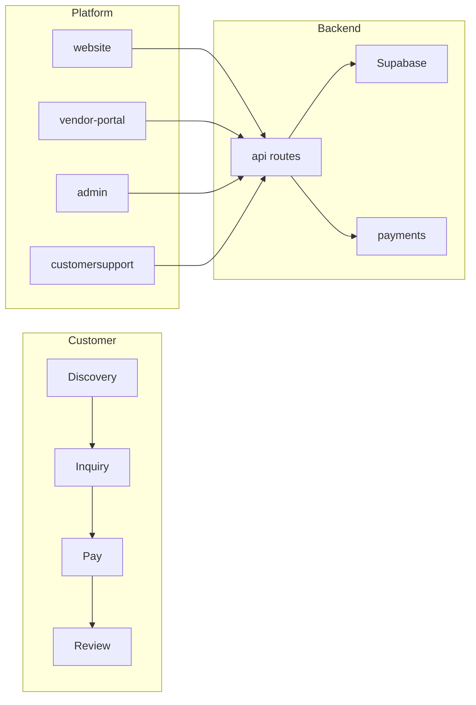

# OpusFesta January–April Implementation Roadmap

## 1. Scope and references

- **Timeline**: January–April 2026 in **2-week coders** (eight periods).
- **Apps/packages**: `apps/website`, `apps/vendor-portal`, `apps/admin`, `apps/customersupport`, `services/api`, `services/payments`, `packages/auth`, `packages/db`, Supabase (migrations, RLS, triggers).
- **Existing docs used**: [docs/BOOKING_INQUIRY_FLOW.md](docs/BOOKING_INQUIRY_FLOW.md), [.cursor/plans/storefront_user_journey.md](.cursor/plans/storefront_user_journey.md), [docs/ESCROW_PAYMENT_SYSTEM.md](docs/ESCROW_PAYMENT_SYSTEM.md), [docs/PAYMENT_METHODS_ESCROW.md](docs/PAYMENT_METHODS_ESCROW.md), [docs/COMPLETE_BOOKING_PAYMENT_FLOW.md](docs/COMPLETE_BOOKING_PAYMENT_FLOW.md), [docs/MOBILE_MONEY_PAYMENT_FLOW.md](docs/MOBILE_MONEY_PAYMENT_FLOW.md), [docs/SUPPORT_SERVICES.md](docs/SUPPORT_SERVICES.md). API surface: [apps/website/src/app/api](apps/website/src/app/api) (bookings, inquiries, invoices, payments, escrow, vendors/search, vendors/collections, admin/reviews).

---

## 2. Timeline (2-week coders)

| Period                  | Focus theme                               | Deliverables                                                                                                                                                                                                                                                                                        | Affected areas                                                                                         |
| ----------------------- | ----------------------------------------- | --------------------------------------------------------------------------------------------------------------------------------------------------------------------------------------------------------------------------------------------------------------------------------------------------- | ------------------------------------------------------------------------------------------------------ |
| **Coder 1** (Jan 1–14)  | Vendor onboarding & storefront foundation | Vendor onboarding when no profile exists (create flow from Storefront tab); completion checklist click-to-jump and UX fixes per storefront plan Phase 1–2.                                                                                                                                          | vendor-portal, packages/auth, Supabase (vendors, RLS)                                                  |
| **Coder 2** (Jan 15–28) | Inquiry → quote in vendor-portal          | Vendor-portal: full inquiry list, accept/decline/respond, quote (create/publish invoice from accepted inquiry), availability view/edit. Harden inquiry status API usage.                                                                                                                            | vendor-portal, website (api/inquiries, api/invoices), Supabase                                         |
| **Coder 3** (Feb 1–14)  | Customer discovery & inquiry UX           | Discovery: search filters (category, location, price, verified), collections UX, saved vendors. Customer inquiry page: status, vendor response, invoice visibility, and "Pay" flow entry.                                                                                                           | website, api/vendors/search, api/vendors/collections, Supabase (search_vendors RPC)                    |
| **Coder 4** (Feb 15–28) | Payment & escrow hardening                | End-to-end: accept → invoice → pay (Stripe + mobile money). Escrow hold/release UI (vendor: complete-work; admin: release). Receipt verify in vendor-portal. Stripe webhook and mobile-money verification paths tested.                                                                             | website, vendor-portal, services/payments, api/payments, api/escrow, Supabase (escrow_holds, triggers) |
| **Coder 5** (Mar 1–14)  | Reviews & admin operations                | Customer: submit review post-booking, view reviews on vendor page. Admin: review moderation (approve/reject/flag) wired to website API; vendor approval workflow (if desired: approve/revoke vendor listing). Basic admin analytics (inquiries, revenue, vendor counts).                            | website, admin, api/admin/reviews, api/reports/vendors, Supabase (reviews, moderation)                 |
| **Coder 6** (Mar 15–28) | Customer support & notifications          | Customer support app: ticket list, create ticket, lookup by inquiry/user/email. In-app notifications (e.g. inquiry accepted, invoice ready, payment received). Email notifications for key milestones (inquiry received, accepted, invoice, payment) using existing Resend templates where present. | customersupport, services/support, website, vendor-portal, api (inquiries, notifications), Supabase    |
| **Coder 7** (Apr 1–14)  | Quality: SEO, analytics, errors           | SEO: meta titles/descriptions, OG tags for vendor and collection pages. Analytics events: search, inquiry submit, payment start/success. Centralized error boundaries and API error responses. Runbooks for payments and escrow.                                                                    | website, admin (if analytics UI), docs/                                                                |
| **Coder 8** (Apr 15–30) | Tests & docs                              | E2E or integration tests for: inquiry submit → accept → invoice → pay (card) and receipt verify (mobile money); escrow complete-work and release. Unit tests for critical API routes. Update BOOKING_INQUIRY_FLOW, COMPLETE_BOOKING_PAYMENT_FLOW, storefront plan, and ESCROW docs.                 | website, vendor-portal, admin, services/payments, docs/                                                |

---

## 3. Component checklist (priority, owner, dependencies)

Aligned with the existing codebase and the docs above.

### Vendor

| Component                                                         | Priority | Owner  | Dependency notes                                                                                                       |
| ----------------------------------------------------------------- | -------- | ------ | ---------------------------------------------------------------------------------------------------------------------- |
| Onboarding when no vendor profile exists (create from Storefront) | P0       | vendor | Unblocks storefront for new vendors; [storefront_user_journey](.cursor/plans/storefront_user_journey.md) Phase 1.      |
| Storefront completion checklist (click-to-jump, progress %)       | P1       | vendor | [storefront_user_journey](.cursor/plans/storefront_user_journey.md) Phase 2.                                           |
| Storefront UX fixes (loading, error recovery, no-vendor state)    | P1       | vendor | Same plan; Phase 1.                                                                                                    |
| Inquiry list and accept/decline/respond in vendor-portal          | P0       | vendor | Depends on api/inquiries/[id]/status (exists). [COMPLETE_BOOKING_PAYMENT_FLOW](docs/COMPLETE_BOOKING_PAYMENT_FLOW.md). |
| Quote flow: create & publish invoice from accepted inquiry        | P0       | vendor | Needs accepted inquiry; api/invoices and api/invoices/[id]/publish exist.                                              |
| Availability view and edit in vendor-portal                       | P1       | vendor | api/vendors/[id]/availability; calendar/availability in storefront.                                                    |
| Mobile money receipt verification in vendor-portal                | P0       | vendor | api/payments/receipts/[id]/verify exists; wire UI in portal.                                                           |
| Escrow: mark work complete (vendor)                               | P0       | vendor | api/escrow/[id]/complete-work; [ESCROW_PAYMENT_SYSTEM](docs/ESCROW_PAYMENT_SYSTEM.md).                                 |

### Customer

| Component                                                        | Priority | Owner    | Dependency notes                                                                                                               |
| ---------------------------------------------------------------- | -------- | -------- | ------------------------------------------------------------------------------------------------------------------------------ |
| Discovery: search (q, category, location, price, verified, sort) | P0       | customer | [api/vendors/search](apps/website/src/app/api/vendors/search/route.ts) and search_vendors RPC exist; harden filters and UX.    |
| Discovery: collections (deals, new, trending, budget, etc.)      | P1       | customer | [api/vendors/collections](apps/website/src/app/api/vendors/collections) and VendorCollectionView exist.                        |
| Saved vendors                                                    | P1       | customer | api/users/saved-vendors, saved page; ensure logged-in flow works.                                                              |
| Full flow: inquiry → quote → accept → payment                    | P0       | customer | Inquiry page shows status/response; InvoiceList + Pay; [COMPLETE_BOOKING_PAYMENT_FLOW](docs/COMPLETE_BOOKING_PAYMENT_FLOW.md). |
| Stripe card payment (intent → confirm → webhook → escrow)        | P0       | customer | api/payments/intent, webhook/stripe, [PAYMENT_METHODS_ESCROW](docs/PAYMENT_METHODS_ESCROW.md).                                 |
| Mobile money (instructions, receipt upload, vendor verify)       | P0       | customer | api/payments/receipts; [MOBILE_MONEY_PAYMENT_FLOW](docs/MOBILE_MONEY_PAYMENT_FLOW.md); reconciliation per doc.                 |
| Escrow hold/release visibility (customer-facing status)          | P2       | customer | Optional "payment held" / "released" messaging.                                                                                |
| Reviews: submit post-booking, display on vendor page             | P1       | customer | api/reviews; can_user_review_vendor; [TEST_REVIEW_MODERATION](docs/TEST_REVIEW_MODERATION.md).                                 |

### Platform

| Component                                                              | Priority | Owner    | Dependency notes                                                                                 |
| ---------------------------------------------------------------------- | -------- | -------- | ------------------------------------------------------------------------------------------------ |
| Admin: vendor approval (approve/revoke listing)                        | P1       | platform | Define "approved" vendor flag and admin UI; RLS/public listing filter.                           |
| Admin: review moderation (approve/reject/flag)                         | P0       | platform | [admin/reviews](apps/admin/src/app/reviews/page.tsx) and api/admin/reviews; wire to website API. |
| Admin: basic analytics (inquiries, revenue, vendor counts)             | P1       | platform | api/reports/vendors; extend or add admin analytics endpoints.                                    |
| Customer support: tickets (list, create, lookup by inquiry/user/email) | P1       | platform | [SUPPORT_SERVICES](docs/SUPPORT_SERVICES.md); customersupport app and services/support.          |
| Notifications: in-app + email (inquiry, accept, invoice, payment)      | P1       | platform | Resend templates in vendor-portal; extend to website and events.                                 |

### Quality

| Component                                        | Priority | Owner   | Dependency notes                                                                                |
| ------------------------------------------------ | -------- | ------- | ----------------------------------------------------------------------------------------------- |
| SEO: meta and OG for vendor/collection/key pages | P1       | quality | website layout and per-page metadata.                                                           |
| Analytics events (search, inquiry, payment)      | P1       | quality | Website and vendor-portal; minimal event schema.                                                |
| Error handling (boundaries, API errors)          | P1       | quality | Centralized patterns; avoid leaking internals.                                                  |
| Tests: critical paths (inquiry → pay, escrow)    | P0       | quality | E2E or API integration; [COMPLETE_BOOKING_PAYMENT_FLOW](docs/COMPLETE_BOOKING_PAYMENT_FLOW.md). |
| Docs/runbooks (payments, escrow, support)        | P2       | quality | Update existing docs; add runbooks for ops.                                                     |

---

## 4. Branch and PR strategy

- **No direct push to main.** All work on feature branches; merge to main via PR (or equivalent) after review.
- **Branch naming**: `feature/<coder-theme>` or `feature/<component>` (e.g. `feature/vendor-onboarding`, `feature/escrow-release-ui`). One branch per coder or per logical feature.
- **Pre-push**: Run `**npm run check:prepush**` from repo root before pushing. It runs [scripts/prepush-check.sh](scripts/prepush-check.sh): nested git check, `git status`, then `turbo run lint test type-check` for workspaces changed since `origin/main` (or HEAD~1 if main not available). PR template already asks for this ([.github/pull_request_template.md](.github/pull_request_template.md)).
- **Where to run**: At repo root; Turbo targets the affected workspaces (e.g. website, vendor-portal, admin). No need to run per-app unless debugging.
- **Conventional commits**: Use types such as `feat`, `fix`, `docs`, `test`, `chore` and concise present-tense messages per workspace rules.

---

## 5. Output artifact

- **Single plan document**: [.cursor/plans/opusfesta-jan-april-roadmap.md](.cursor/plans/opusfesta-jan-april-roadmap.md) — to contain the timeline table (Section 2), component checklist (Section 3), and branch/PR strategy (Section 4) so the roadmap lives in one place.
- **No code changes** in this task; only the plan and the new roadmap doc are produced.

---

## 6. Diagram (high-level flow)

---

## 7. Summary

- **Eight 2-week coders** from January through April cover vendor onboarding and storefront, inquiry/quote/availability in the portal, customer discovery and full inquiry→payment flow, Stripe and mobile money with escrow, reviews and admin moderation, customer support and notifications, then SEO/analytics/errors and tests/docs.
- **Component checklist** is ordered by P0/P1/P2 and owner (vendor/customer/platform/quality) with explicit dependency notes and doc references.
- **Branch/PR**: feature branches only, `npm run check:prepush` at root before push, conventional commits. The full roadmap is captured in `.cursor/plans/opusfesta-jan-april-roadmap.md`.
