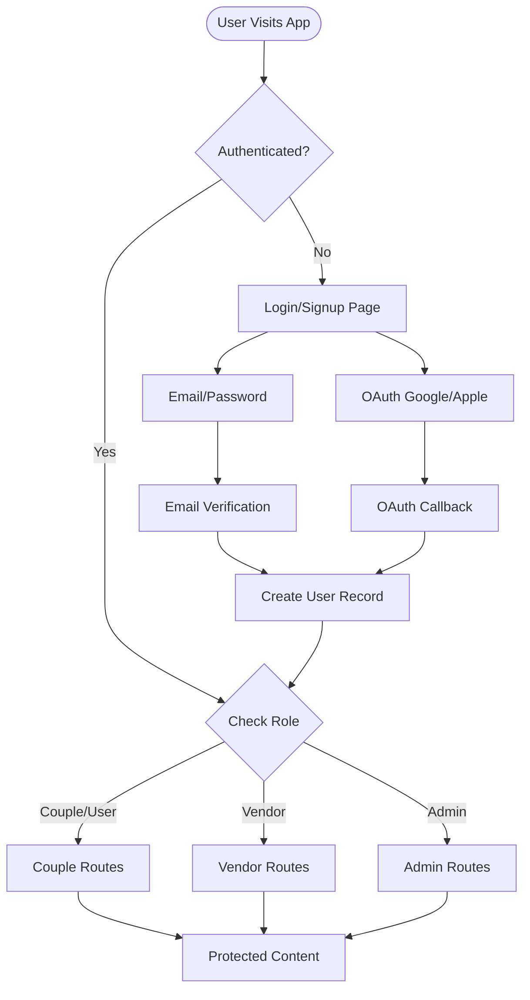

# Authentication & Access Control Documentation

## Overview

The OpusFesta website application uses Supabase for authentication with a comprehensive access control system. This document describes the authentication flows, access control patterns, and how to use the authentication utilities.

## Architecture

### Authentication Flow



### Components

1. **AuthContext** - Centralized auth state management
2. **AuthGuard** - Client-side route protection component
3. **ProtectedRoute** - Higher-level wrapper for protected pages
4. **Middleware** - Server-side route protection
5. **API Auth Utilities** - Server-side API route protection

## User Roles

The application supports three user roles:

- **user** (couple) - Regular users planning their wedding
- **vendor** - Service providers
- **admin** - Administrators

## Authentication Methods

### 1. Email/Password Authentication

Users can sign up and sign in using email and password.

**Sign Up Flow:**
1. User fills signup form (name, email, password, user type)
2. Account created in Supabase Auth
3. Verification code sent to email
4. User verifies email with code
5. User record created in database
6. User redirected based on role

**Sign In Flow:**
1. User enters email and password
2. Supabase authenticates user
3. User record verified/created
4. Session established
5. User redirected based on role

### 2. OAuth Authentication (Google & Apple)

Users can sign in with Google or Apple accounts.

**OAuth Flow:**
1. User clicks OAuth button
2. User type selection modal appears (for signup)
3. User redirected to OAuth provider
4. Provider redirects back to `/auth/callback`
5. Session established
6. User record created/verified
7. User redirected based on role

### 3. Password Reset

Users can reset their password using a code-based flow:

1. User requests password reset
2. Reset code sent to email
3. User enters code on verification page
4. User sets new password
5. Password updated
6. User redirected to login

## Access Control

### Route Protection

Routes are protected at multiple levels:

1. **Middleware** - Server-side protection for all routes
2. **AuthGuard** - Client-side component protection
3. **API Routes** - Server-side API protection

### Route Access Configuration

Routes are configured in `apps/website/src/lib/access-control.ts`:

```typescript
export const ROUTE_ACCESS: Record<string, UserRole[]> = {
  "/vendors/saved": ["user", "admin"],
  "/my-inquiries": ["user", "admin"],
  "/vendor-portal": ["vendor", "admin"],
  "/admin": ["admin"],
  // ...
};
```

### Protecting Pages

#### Using AuthGuard Component

```tsx
import { AuthGuard } from "@/components/auth/AuthGuard";

export default function ProtectedPage() {
  return (
    <AuthGuard>
      <YourPageContent />
    </AuthGuard>
  );
}
```

#### Using ProtectedRoute Wrapper

```tsx
import { ProtectedRoute } from "@/components/auth/ProtectedRoute";

export default function ProtectedPage() {
  return (
    <ProtectedRoute role="vendor">
      <YourPageContent />
    </ProtectedRoute>
  );
}
```

#### Role-Based Protection

```tsx
import { AuthGuard } from "@/components/auth/AuthGuard";

export default function AdminPage() {
  return (
    <AuthGuard requireRole="admin">
      <AdminContent />
    </AuthGuard>
  );
}
```

#### Multiple Roles

```tsx
import { AuthGuard } from "@/components/auth/AuthGuard";

export default function VendorOrAdminPage() {
  return (
    <AuthGuard requireAnyRole={["vendor", "admin"]}>
      <VendorContent />
    </AuthGuard>
  );
}
```

### Protecting API Routes

#### Using requireAuth

```typescript
import { requireAuth, handleAuthError } from "@/lib/api-auth";

export async function POST(request: NextRequest) {
  try {
    const user = await requireAuth(request);
    // User is authenticated, proceed with request
    // ...
  } catch (error) {
    return handleAuthError(error);
  }
}
```

#### Using requireRole

```typescript
import { requireRole, handleAuthError } from "@/lib/api-auth";

export async function POST(request: NextRequest) {
  try {
    const user = await requireRole(request, "admin");
    // User is admin, proceed with request
    // ...
  } catch (error) {
    return handleAuthError(error);
  }
}
```

#### Using withAuth Wrapper

```typescript
import { withAuth } from "@/lib/api-auth";

export const POST = withAuth(async (request, user) => {
  // User is authenticated
  // Handle request...
  return NextResponse.json({ success: true });
});
```

## Session Management

### Getting Current Session

```typescript
import { getSession } from "@/lib/session";

const session = await getSession();
```

### Refreshing Session

```typescript
import { refreshSession } from "@/lib/session";

const session = await refreshSession();
```

### Checking Session Expiry

```typescript
import { checkSessionExpiry } from "@/lib/session";

const isExpired = await checkSessionExpiry(session);
```

### Handling Expired Sessions

```typescript
import { handleExpiredSession } from "@/lib/session";

await handleExpiredSession("/login");
```

### Remember Me

The "Remember me" functionality extends session duration:

```typescript
import { setRememberMe, isRememberMeEnabled } from "@/lib/session";

// Set remember me preference
setRememberMe(true);

// Check if enabled
const enabled = isRememberMeEnabled();
```

## Using AuthContext

The `AuthContext` provides centralized auth state:

```tsx
import { useAuth } from "@/contexts/AuthContext";

function MyComponent() {
  const { user, session, isLoading, isAuthenticated, signOut } = useAuth();

  if (isLoading) {
    return <div>Loading...</div>;
  }

  if (!isAuthenticated) {
    return <div>Please sign in</div>;
  }

  return (
    <div>
      <p>Welcome, {user?.name}</p>
      <button onClick={signOut}>Sign Out</button>
    </div>
  );
}
```

## Conditional Rendering

Use conditional rendering components to show/hide content based on auth state:

```tsx
import { RequireAuth, RequireRole, IfAuthenticated } from "@/components/auth/ConditionalRender";

function MyComponent() {
  return (
    <div>
      <RequireAuth>
        <p>This is only visible to authenticated users</p>
      </RequireAuth>

      <RequireRole role="admin">
        <p>This is only visible to admins</p>
      </RequireRole>

      <IfAuthenticated
        fallback={<p>Please sign in</p>}
      >
        <p>You are signed in!</p>
      </IfAuthenticated>
    </div>
  );
}
```

## Error Handling

### Auth Errors

Use the auth error utilities for consistent error handling:

```typescript
import { parseAuthError, AuthErrorCode } from "@/lib/auth-errors";

try {
  // Auth operation
} catch (error) {
  const parsed = parseAuthError(error);
  // parsed.code - Error code
  // parsed.message - User-friendly message
}
```

### Error Codes

- `INVALID_CREDENTIALS` - Invalid email or password
- `EMAIL_NOT_VERIFIED` - Email not verified
- `SESSION_EXPIRED` - Session expired
- `UNAUTHORIZED` - Not authenticated
- `FORBIDDEN` - Insufficient permissions
- `NETWORK_ERROR` - Network error
- `OAUTH_PROVIDER_NOT_ENABLED` - OAuth provider not enabled

## Redirects

### Redirect After Login

```typescript
import { redirectAfterLogin } from "@/lib/redirects";

redirectAfterLogin("user", "couple", "/dashboard");
```

### Redirect to Login

```typescript
import { redirectToLogin } from "@/lib/redirects";

redirectToLogin("/protected-page");
```

### Redirect Unauthorized

```typescript
import { redirectUnauthorized } from "@/lib/redirects";

redirectUnauthorized("admin", "/current-page");
```

## Access Control Utilities

### Check Authentication

```typescript
import { requireAuth } from "@/lib/access-control";

const isAuthenticated = await requireAuth();
```

### Check Role

```typescript
import { requireRole } from "@/lib/access-control";

const hasRole = await requireRole("admin");
```

### Check Route Access

```typescript
import { canAccessRoute } from "@/lib/access-control";

const canAccess = canAccessRoute("/admin", "admin");
```

### Get Allowed Routes

```typescript
import { getAllowedRoutes } from "@/lib/access-control";

const routes = getAllowedRoutes("vendor");
```

## Middleware

The middleware (`apps/website/src/middleware.ts`) protects routes server-side:

- Checks authentication for protected routes
- Verifies user roles for role-based routes
- Redirects unauthenticated users to login
- Preserves intended destination (`next` parameter)

## Best Practices

1. **Always use AuthContext** for client-side auth state
2. **Use AuthGuard** for protecting pages
3. **Use API auth utilities** for protecting API routes
4. **Handle errors gracefully** using auth error utilities
5. **Check roles** before rendering sensitive content
6. **Preserve redirect URLs** when redirecting to login
7. **Handle expired sessions** gracefully
8. **Use Remember me** for better UX

## Security Considerations

1. **Never expose sensitive data** in client-side code
2. **Always verify authentication** on the server
3. **Use RLS policies** in Supabase for database security
4. **Validate user input** on both client and server
5. **Handle errors** without exposing sensitive information
6. **Use HTTPS** in production
7. **Implement rate limiting** for auth endpoints
8. **Monitor auth failures** for security threats

## Troubleshooting

### Session Not Persisting

- Check if "Remember me" is enabled
- Verify Supabase client configuration
- Check browser localStorage/sessionStorage

### Redirect Loops

- Ensure middleware doesn't protect auth pages
- Check redirect guards in AuthGuard
- Verify session is properly established

### Role Not Updating

- Check user record in database
- Verify role mapping functions
- Ensure session is refreshed after role change

### OAuth Not Working

- Verify OAuth providers are enabled in Supabase
- Check redirect URLs are configured correctly
- Ensure OAuth callback handler is working

## Examples

### Complete Protected Page Example

```tsx
"use client";

import { AuthGuard } from "@/components/auth/AuthGuard";
import { useAuth } from "@/contexts/AuthContext";

function DashboardContent() {
  const { user } = useAuth();

  return (
    <div>
      <h1>Welcome, {user?.name}</h1>
      {/* Dashboard content */}
    </div>
  );
}

export default function DashboardPage() {
  return (
    <AuthGuard>
      <DashboardContent />
    </AuthGuard>
  );
}
```

### Complete API Route Example

```typescript
import { NextRequest, NextResponse } from "next/server";
import { requireAuth, handleAuthError } from "@/lib/api-auth";

export async function GET(request: NextRequest) {
  try {
    const user = await requireAuth(request);
    
    // Fetch user-specific data
    // ...
    
    return NextResponse.json({ data: "..." });
  } catch (error) {
    return handleAuthError(error);
  }
}
```

## File Structure

```
apps/website/src/
├── lib/
│   ├── auth.ts                    # Core auth utilities
│   ├── access-control.ts          # Access control utilities
│   ├── api-auth.ts                # API route auth utilities
│   ├── session.ts                 # Session management
│   ├── auth-errors.ts             # Error handling
│   └── redirects.ts               # Redirect utilities
├── components/
│   └── auth/
│       ├── AuthGuard.tsx          # Route protection component
│       ├── ProtectedRoute.tsx    # Protected route wrapper
│       ├── OAuthUserTypeSelector.tsx  # OAuth user type selector
│       └── ConditionalRender.tsx  # Conditional rendering components
├── contexts/
│   └── AuthContext.tsx            # Auth context provider
└── middleware.ts                  # Next.js middleware
```

## Additional Resources

- [Supabase Auth Documentation](https://supabase.com/docs/guides/auth)
- [Next.js Middleware Documentation](https://nextjs.org/docs/app/building-your-application/routing/middleware)
- [React Context Documentation](https://react.dev/reference/react/useContext)
